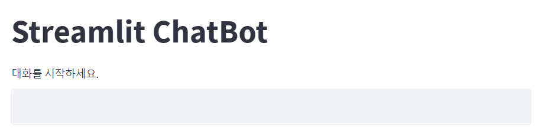
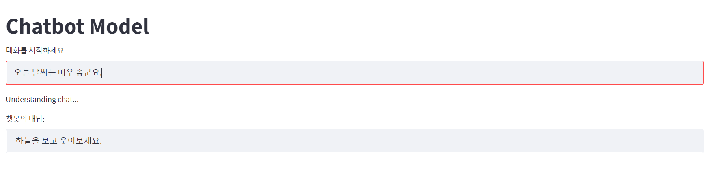
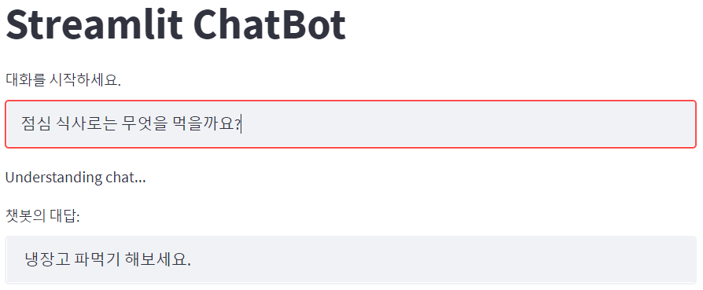

# streamlit에서 챗봇 구현

1. `KoGPT_2_based_Chatbot.ipynb` 실행

```shell
위 파일을 실행시켜 chitchat-model.pth를 생성 및 저장합니다.
```

2. `streamlit run myapp.py` 실행

```shell
커맨드창에서 위 명령어를 실행시켜 챗봇 모델을 시연해 볼 수 있는 streamlit 페이지로 이동합니다.
```

<br/><br/>

# 실행 화면

* 초기 화면



<br/>

* 실행 예시 1



<br/>

* 실행 예시 2

