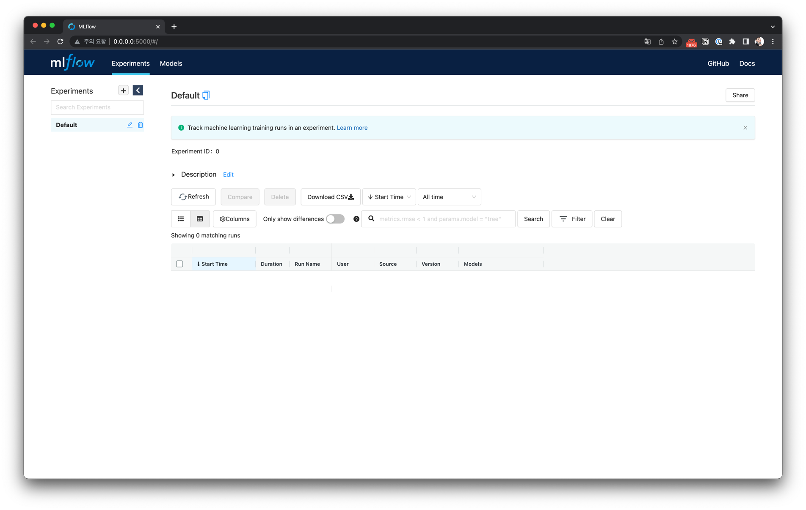

# MLflow


- MLflow를 Docker를 활용해서 띄우는 것은 간단합니다
- Docker Image를 어떻게 찾을까?

- Docker Image 찾는 방법
    - 1) 공식 문서에 있는 확인한다 : 만약 존재하면 사용한다
    - 2) 공식 문서에 Docker Image가 없다면, 찾아본다
        - ㄱ) Github Repo에 유저들이 만든 것이 있는지 확인
        - ㄴ) Docker Hub에 유저들이 만든 것이 있는지 확인
        - ㄷ) 직접 Docker Image를 생성
    - 단, Docker Hub는 Download Limit이 존재합니다. [문서](https://docs.docker.com/docker-hub/download-rate-limit/)를 확인하면 알 수 있습니다
    - 회사에선 별도의 Docker Registry를 구축한 후, Registry에서 가져오는 방식을 구현합니다
        
---

### 1) Docker로 MLflow 실행하기

Dockerfile을 아래와 같이 생성합니다

```Dockerfile
FROM python:3.9.10-slim-buster

COPY requirements.txt mlflow/requirements.txt
WORKDIR mlflow

RUN apt-get update && \
    pip install pip --upgrade && \
    pip install -r requirements.txt

CMD ["mlflow", "ui", "-h", "0.0.0.0", "-p", "5000"]
```


아래 명령어로 Docker 이미지를 빌드합니다.

```bash
$ docker build -t mlflow:1.24.0 .
```

빌드되면 다음처럼 확인할 수 있습니다

```bash
$ docker images | grep mlflow
mlflow                                    1.24.0            072b9199e5d1   2 minutes ago   611MB
```

이제 이미지를 컨테이너로 실행합니다

```bash
$ docker run --name mlflow -p 5000:5000 -v $(pwd):/mlflow --rm mlflow:1.24.0

[2022-04-09 06:28:13 +0000] [12] [INFO] Starting gunicorn 20.1.0
[2022-04-09 06:28:13 +0000] [12] [INFO] Listening at: http://0.0.0.0:5000 (12)
[2022-04-09 06:28:13 +0000] [12] [INFO] Using worker: sync
[2022-04-09 06:28:13 +0000] [13] [INFO] Booting worker with pid: 13
```

`--rm` : 컨테이너 종료시 컨테이너와 관련된 리소스(파일 시스템, 볼륨) 삭제 - 1회용일 때 활용


### 2) Docker-compose로 MLflow 실행하기

docker-compose.yml을 아래와 같이 생성합니다

```yaml
version: "3.7"

services:
  web_ui:
    image: mlflow:1.24.0
    ports:
      - 5000:5000
    volumes:
      - ./:/mlflow
```

아래 명령어로 Docker Compose를 실행합니다

```bash
$ docker-compose up

Docker Compose is now in the Docker CLI, try `docker compose up`

Creating network "04-mlflow_default" with the default driver
Creating 04-mlflow_web-ui_1 ... done
Attaching to 04-mlflow_web-ui_1
web_ui_1  | [2022-04-09 06:39:22 +0000] [13] [INFO] Starting gunicorn 20.1.0
web_ui_1  | [2022-04-09 06:39:22 +0000] [13] [INFO] Listening at: http://0.0.0.0:5000 (13)
web_ui_1  | [2022-04-09 06:39:22 +0000] [13] [INFO] Using worker: sync
web_ui_1  | [2022-04-09 06:39:22 +0000] [14] [INFO] Booting worker with pid: 14
```

## 사용 방법

브라우저에서 `http://0.0.0.0:5000/` 에 접속하면 다음처럼 MLflow Web UI를 확인할 수 있습니다


